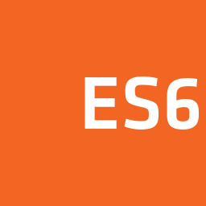

## Hi 👋 !

### I am Mohan Oli

<em><small style='font-size:12px;'> I am currently 4th year Student at Chitkara University !!</small></em>

_Technologies That I use_

### Frontend Technologies 

  
  
  
  
  
  
  

 

### Backend Technologies

  
  
  
  
  

### Tools

  
  
  
   

